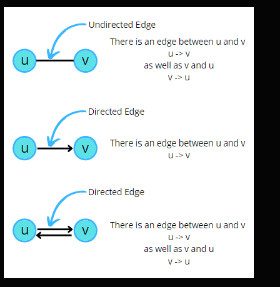
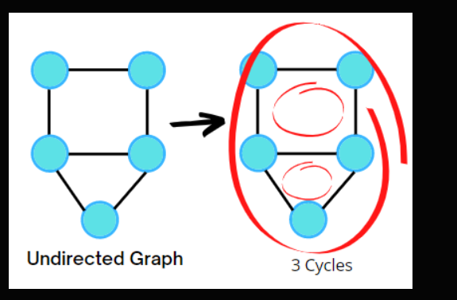
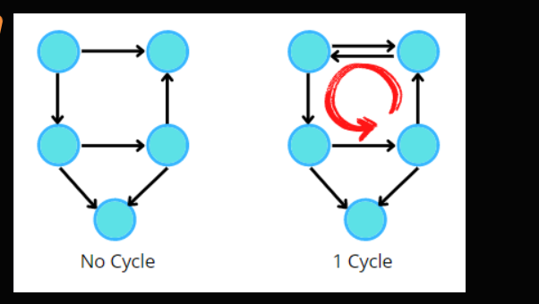
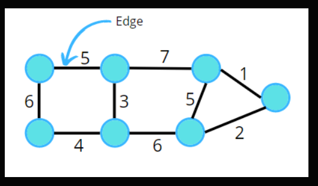
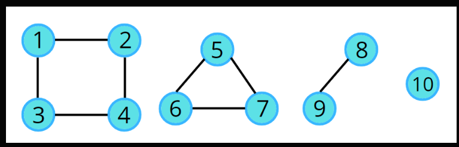
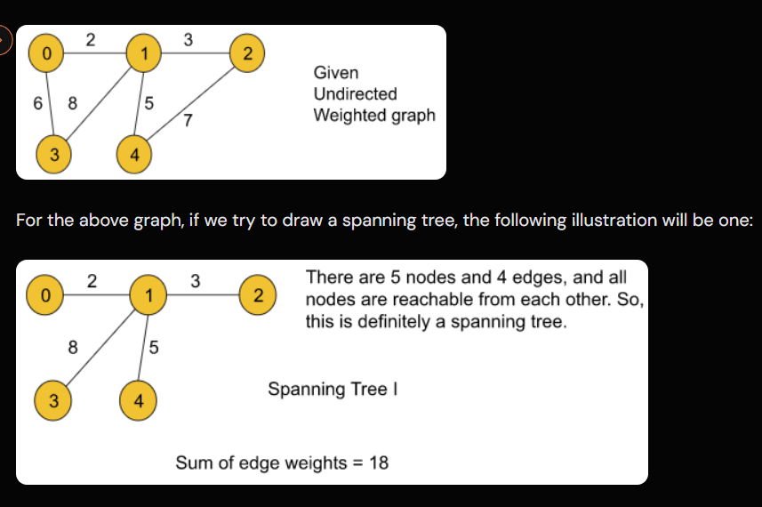
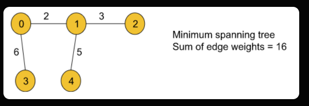

# Graphs

## 1. Undirected Graph

## 2. Directed Graph

---

## 📘 Some Terminologies

- **Edge**: A connection between two nodes.
  - _Undirected Edge_: No direction.
  - _Directed Edge_: Has a direction (arrow).
- **Node / Vertex**: A fundamental unit or point in the graph.

---



---

## 🔁 Cycle in a Graph

A **Cycle** occurs if we start from a node and can return to it via a path.

### Example:

  
➡️ This is an **Undirected Cyclic Graph**.



- 1st Graph: **Directed Acyclic Graph (DAG)** - In a DAG (Directed Acyclic Graph), there will always be at least one node with in-degree 0.
- 2nd Graph: **Directed Cyclic Graph**

---

## 🛣️ Path in a Graph

A **Path** is a sequence of unique, adjacent nodes where each node is reachable from the previous one.

```
1───2
    │
4───3
   /
  5
```

### Valid Paths:

- `1 → 2 → 3 → 5` ✅

### Invalid Paths:

- `1 → 2 → 3 → 2 → 1` ❌ (Node repetition not allowed)
- `1 → 3 → 5` ❌ (No edge between 1 and 3)

---

## 🔢 Degree of a Graph

The **Degree** of a node is the number of edges connected to it.

### In Undirected Graph:

```
1───2
│   │
4───3
 \ /
  5
```

- `Degree(2) = 2`
- `Degree(3) = 3`
- `Degree(5) = 2`

🧠 **Property**:  
Sum of all node degrees = `2 × number of edges`

---

### In Directed Graph:

- **InDegree**: Number of edges coming _into_ a node.
- **OutDegree**: Number of edges going _out of_ a node.

```
 1 ──▶ 2
 │      ▲
 ▼      │
 4 ──▶ 3
  ╲    ╱
   ▼  ▼
    5
```

- `InDegree(3) = 1`
- `OutDegree(3) = 2`

---

## ⚖️ Edge Weight

A graph may have **weights** assigned to its edges. These weights often represent **cost** or **distance**.



> If weights are **not assigned**, we assume **unit weight** (`= 1`) for each edge by default.

---

# Representation of Graph:

1. **Adjacency Matrix** - SC: O(V\*V)

    - useful when dense graph or when edge existence needs O(1) check.

2. **Adjacency Lists** - SC: O(2\*E) - UnDirectedGraph, O(E) - DirectedGraph (Stores all neighbors for a particular node)

## Types of Graphs usually used in programming:

### 1. Undirected Graph

```java
int n = 5;
int[][] edges = {
    {5, 1},
    {5, 2},
    {3, 4}
};
```

#### Approach 1: Using HashMap:
```java
Map<Integer, List<Integer>> graph = new HashMap<>();

for (int[] edge : edges) {
    int u = edge[0], v = edge[1];

    graph.putIfAbsent(u, new ArrayList<>());
    graph.putIfAbsent(v, new ArrayList<>());

    graph.get(u).add(v);
    graph.get(v).add(u); // For undirected
}
```
#### Approach 2: Using ArrayList:
```java
List<List<Integer>> graph = new ArrayList<>();
for (int i = 0; i < n; i++) {
    graph.add(new ArrayList<>());
}

for(int[] edge : edges) {
    int u = edge[0], v = edge[1];

    graph.get(u).add(v);
    graph.get(v).add(u);  // For undirected
}
```

### 2. Directed Graph

```java
int n = 5;
int[][] edges = {
    {5, 1},
    {5, 2},
    {3, 4}
};
```

#### Approach 1: Using HashMap:
```java
Map<Integer, List<Integer>> graph = new HashMap<>();

for (int[] edge : edges) {
    int u = edge[0], v = edge[1];

    graph.putIfAbsent(u, new ArrayList<>());
    graph.putIfAbsent(v, new ArrayList<>());

    graph.get(u).add(v);
}
```

#### Approach 2: Using ArrayList:
```java
List<List<Integer>> graph = new ArrayList<>();
for (int i = 0; i < n; i++) {
    graph.add(new ArrayList<>());
}

for(int[] edge : edges) {
  int u = edge[0], v = edge[1];

  graph.get(u).add(v);
}
```

### 3. Weighted Graph

```java
int n = 4;
int[][] edges = {
    {0, 1, 5},
    {1, 2, 3},
    {2, 3, 7}
};
```

#### Approach 1: Using HashMap:
```java
Map<Integer, List<Pair<Integer, Integer>>> graph = new HashMap<>();

for (int[] edge : edges) {
    int u = edge[0], v = edge[1], weight = edge[2];

    graph.putIfAbsent(u, new ArrayList<>());
    graph.get(u).add(new Pair<>(v, weight));
    graph.get(v).add(new Pair<>(u, weight)); // For undirected only
}
```

#### Approach 2: Using ArrayList:
```java
List<List<Pair<Integer, Integer>>> graph = new ArrayList<>();
for (int i = 0; i < n; i++) {
    graph.add(new ArrayList<>());
}

for(int[] edge : edges) {
  int u = edge[0], v = edge[1], weight = edge[2];

  graph.get(u).add(new Pair<>(v, weight));
  graph.get(v).add(new Pair<>(u, weight)); // For undirected only
}
```

```java
class Pair<U, W> {
  public final U vertex;
  public final W weight;
  public Pair(U vertex, W weight) {
    this.vertex = vertex;
    this.weight = weight;
  }
}
```

# Connected Components

Given an undirected graph with 10 nodes and 8 edges. The edges are (1,2), (1,3), (2,4), (4,3), (5,6), (5,7), (6,7), (8,9) .The graph that can be formed with the given information is as follows:



Is this a single Graph?? - YES (as per the question) Its a *single graph with **4 connected components***.

As this graph has Connected components, Traversing from single node will not traverse all nodes.. that's why we use visited array to store visited nodes. *(Very important ⭐ - logic to be used in problems)*

```java
int n = 10;  // 10 nodes
int[] vis = new int[n+1];

for(int i=1; i<n+1; i++) {
    if(!vis[i]){
        traverse(i);
    }
}
```
### No. of Connected Components Problems
1. [Number of Provinces](https://leetcode.com/problems/number-of-provinces)
2. [Number of Islands](https://leetcode.com/problems/number-of-islands/)

## BFS Traversal

**TC:** O(V + E) — Visit each vertex once, process each edge once  
**SC:** O(V) — Visited array + Queue (worst case: all vertices in queue)

```java
private List<Integer> bfs(int n, List<List<Integer>> adjList) {
    List<Integer> res = new ArrayList<>();
    int[] vis = new int[n];
    Queue<Integer> queue = new ArrayDeque<>();

    queue.offer(0);
    vis[0] = 1;

    while(!queue.isEmpty()) {
        int polledNode = queue.poll();
        res.add(polledNode);

        for(int neighbor: adjList.get(polledNode)) {
            if(vis[neighbor] == 0) {
                queue.offer(neighbor);
                vis[neighbor] = 1;
            }
        }
    }

    return res;
}
```

## DFS Traversal

**TC:** O(V + E) — Visit each vertex once, process each edge once  
**SC:** O(V) — Visited array + Recursion stack (worst case: skewed graph)

```java
private void dfs(int node, int[] vis, List<List<Integer>> adjList, List<Integer> res) {
    vis[node] = 1;
    res.add(node);

    for(int neighbor: adjList.get(node)) {
        if(vis[neighbor] == 0) {
            dfs(neighbor, vis, adjList, res);
        }
    }
}
```

Problem Types:
1. Proper graph is given (either edges 2D array / Adjacency Matrix / Adjacency List) with no. of vertices.
2. Matrix is given and its a graph where a cell's neighbor are its adjacent cells.
```text
( r-1, c-1 )   ( r-1, c )   ( r-1, c+1 )
     ↖             ↑             ↗
                  -1-
                   ↑ 
( r,   c-1 ) ← (  r,  c  ) → ( r,   c+1 )
     -1←         (you)         →+1

( r+1, c-1 )   ( r+1, c )   ( r+1, c+1 )
     ↙             ↓             ↘
                  +1+
```

## [Detect Cycle in Undirected Graph](https://www.geeksforgeeks.org/problems/detect-cycle-in-an-undirected-graph/1)
    1. Using DFS
    2. Using BFS


### Matrix Graph Problems

1. [Flood Fill](https://leetcode.com/problems/flood-fill) **[BFS]**
2. [Rotting Oranges](https://leetcode.com/problems/rotting-oranges) **[MultiSource BFS]** 
4. [Distance of Nearest Zero](https://leetcode.com/problems/01-matrix) **[MultiSource BFS]** [Reverse thinking]
5. [Surrounded Regions](https://leetcode.com/problems/surrounded-regions/) **[DFS/BFS]** [Reverse thinking]
6. [No. of Enclaves](https://leetcode.com/problems/number-of-enclaves/) **[MultiSource BFS]**

7. [As Far From Land As Possible](https://leetcode.com/problems/as-far-from-land-as-possible/) [easy]


## Bipartite Graph
- Color the graph with 2 colors such that no adjacent nodes has same color (Generally used for Undirected Graph).

- Linear Undirected Graph(Acyclic graph) will always be a Bipartite Graph.
- Any Undirected Cyclic Graph with all **even cycle lengths** will always be a Bipartite Graph.
- Any Undirected Cyclic Graph with a odd cycle length will not be a Bipartite Graph.

### Bipartite Graph Problems:
1. [Is Graph Bipartite](https://leetcode.com/problems/is-graph-bipartite) [DFS, BFS]

## Topological Sort

- Linear Ordering of vertices such that if there is an edge from u to v, u appears before v in that ordering.
- Topological sort gives you an order to complete all tasks without breaking any dependencies.
- Exists on DAG only (why ?? - becoz ordering cannot happen on Cyclic Graph)
- There can be many valid linear ordering(topological sorts).

```text
5 → 0 ← 4
↓       ↓
2 → 3 → 1
```

Valid Topologicaal sort:
1. 5, 4, 2, 3, 1, 0
2. 4, 5, 2, 3, 1, 0
3. 5, 4, 0, 2, 3, 1
and many more...

Note:
If Topo Sort is 1, 2, 3, 4, 5
then it means that from node 3, nodes 1 & 2 are not reachable
but from node 3 , nodes 4 & 5 might or might not be reachable...

The arrow points in the direction of execution.
edge a -> b:

- b depends on a.
- a must be completed first before you can even start b.
- a is the prerequisite; b is the dependent.

Indegree literally translates to 
    - "How many prerequisites/dependencies are blocking me from starting?"
    - "How many other dependencies I have?"

If Indegree = 0
    - "Node can start immediately as Node don't have any prerequisites/dependencies"

If Indegree = n
    = "First process/start n dependencies and then I can be processed"


Usecase where it is used:
Anywhere you have prerequisites or dependencies, topological sort tells you what to do first, second, third… and so on.

example:
Task Scheduling / Job Scheduling
You have a set of tasks with dependencies. You can’t start one task before another finishes.
Course Prerequisites
You have multiple courses, and some courses require others to be taken first.
Dependency Resolution in Package Managers
Package managers like npm, pip, or apt resolve dependencies using topological sort.
Build Order in Software Projects
Projects often consist of multiple modules. Some depend on others to be built first.
Instruction Scheduling in CPUs / Compilers
Instruction reordering for optimization without violating dependencies is done using topological sorting.

## Find Topological Sort
    1. Using DFS
        - If Graph is Cyclic then res is empty array
    2. Using BFS (**Kahn's Algorithm**)
        - If Graph is Cyclic then res.length != total no. of vertex

## [Detect Cycle in Directed Graph](https://www.geeksforgeeks.org/problems/detect-cycle-in-a-directed-graph/1)
    1. Using DFS
    2. Using BFS **Kahns Algorithm**

## Topological sort Problem Pattern
1. [Find Eventual Safe States](https://leetcode.com/problems/find-eventual-safe-states/)
2. [Course Schedule 1](https://leetcode.com/problems/course-schedule/)
3. [Course Schedule 2](https://leetcode.com/problems/course-schedule-ii/)


Relaxation is a fancy term in Graph Algorithm that simply means:
✅ Try to improve the current known shortest distance to a node by checking if going through another node gives a shorter path.

## Shortest Path in DAG
- Find the shortest path in Directed Acyclic Graph.
    - with TopoSort + Relaxation
    - with BFS + Queue (similar to Dijktras but without priorityQueue)

## Shortest Path in Undirected UnWeighted Graph
- Find the shortest path in Undirected Graph.
    - with BFS + Queue (First time we reach node will be the shortest path as we have BFS and unit weight..)


BFS = shortest distance/path......

Word Ladder 1
Word Ladder 2

# Dijkstras Algorithm

1. Using BFS + Queue (very rarely used)

2. Using BFS + PriorityQueue (Greedy BFS algorithm)

3. Using Set (Greedy BFS Algorithm)

Does not work with -ve Edges. WHY ??
- Dijkstra marks a node as "done" once popped from PQ, assuming its shortest path is finalized.
- With -ve edges, a later path through a negative edge could give a shorter distance to an already "done" node.
- Since Dijkstra won't revisit "done" nodes, it misses the shorter path → incorrect result.

Does not work with -ve cycles. WHY ??
- A -ve cycle allows infinite reduction of path cost (keep looping to reduce distance).
- Dijkstra has no mechanism to detect or handle this → either infinite loop or wrong answer.

Time Complexity Analysis of Djiktras Algorithm:
while loop runs for atmost E times.. so, 
1. queue.poll() happens for E times therefore it takes E*log(queue-size)..
2. queue.offer() also happens atmost E times (considering for every edge we got shortest path so we push vertex to queue) therefore it also takes E*log(queue-size)...

there for total TC: E*log(queue-size) + E*log(queue-size) = 2*E*log(queue-size)

now what is queue-size? = at max it could** be E (as we are performing E enqueues and dequeues) BUT it will always be less than E at any current moment.. so V <= queue-size < E.. if taking amortized value from it will be V amortized.. (not exactly V but near about greater than V)

therefore total TC = 2*E*logV  which can be generalized to ElogV.

PS. for dense graph E = V^2 but this above TC is generalized for worst case for all types of graph 

PS. also for TreeSet solution (Theoretical / Decrease-Key Djiktras Version) we remove element from set at most V times but could endup removing, adding both in set E times for relaxation therefore there TC is O(VlogV + 2*ElogV) which can be generalized with (V+E)*logV.

## Print Shortest Path between first node 0 to last node n

- Dijktras Algo + I have to remember from where I have been coming from...


Problem:
1. [Shortest path in a binary maze](https://leetcode.com/problems/shortest-path-in-binary-matrix/) [BFS+Queue] [why dist array is not required]
2. [Path with Minimum Effort](https://leetcode.com/problems/path-with-minimum-effort/)
3. [Cheapest Flights Within K Stops](https://leetcode.com/problems/cheapest-flights-within-k-stops/)
4. [Network Delay Time](https://leetcode.com/problems/network-delay-time/)
5. [Number of Ways to Arrive at Destination](https://leetcode.com/problems/number-of-ways-to-arrive-at-destination/)


-ve Cycles = Cycle where Path weight is -ve.
- Shortest Path doesn't exists if Graph consist of -ve Cycle.

## Bellman Ford Algorithm

- Uses edges array.
- Works with -ve edges. WHY ??
- Detect -ve cycles HOW & WHY ??
- works only for Directed Graph
    - for Undirected Graph -> convert it to Directed Graph WHY ??

we have to Relax All edges V-1 times sequentially. WHY ??


## Floyd Warshall Algorithm

- Multi Source Shortest Path Algorithm
- Uses Adjacency Matrix
- Works with -ve edges
- Detect -ve cycles

Problem:
1. [Find City with Smallest Number of Neighbors at a Threshold Distance](https://leetcode.com/problems/find-the-city-with-the-smallest-number-of-neighbors-at-a-threshold-distance/)


# Minimum Spanning Tree

## Spanning Tree
- A undirected tree(i.e contains no cycle) in which we have N nodes, and N-1 edges and all nodes are reachable from each other(i.e 1 component only).
- A graph may have more than one spanning trees.
- Applicable to Undirected Acyclic (1-Component) Graphs only.

Example:


## Minimum Spanning Tree

- Among all possible spanning trees of a weighted graph, the MST is the one with the minimum total edge weight.
- MST = "Cheapest way to connect all nodes without cycle".
- MST = "Cheapest connected skeleton (tree - without cycle)".
- MST = "Minimum weight set of edges that connects all vertices without cycle"
- **without cycle** is important as in a graph with -ve cycle, we could end up having Cheapest way to connect all nodes with cycle..
    Ex: Graph with Edges: AB=−1, BC=−2, CA=−3. we have:
    Cheapest way to connect all nodes = AC, CB, CB which has weight = -6. (happens if all nodes in the -ve cycle is -ve)
    MST (Cheapest way to connect all nodes without cycle) = AC, CB which has weight = -5.
- There can be multiple MST for a graph.
- Application: Imagine you’re laying cables to connect cities. You want to connect every city with the least total cable cost, while avoiding unnecessary loops → That’s MST.
- Edge weight of MST = MST Weight.

Example MST for above graph:


Properties of MST
1. Number of edges: Always V – 1.
2. Uniqueness:
    - If all edge weights are distinct, the MST is unique.
    - If some edges have equal weights, there can be multiple MSTs.
3. Cut Property: For any cut (partition of vertices into 2 sets), the minimum weight edge crossing that cut must be part of the MST.

Use Cases of MST

1. Network design: Designing telecommunication networks, roads, electricity cables.
2. Cluster analysis in ML: Grouping data points.
3. Image segmentation in computer vision.
4. Approximation algorithms: e.g., for the Traveling Salesman Problem (TSP).


How to find MST for a given Graph
1. Prim's Algorithm:
- Finds mstWeight and MST also.
- Uses Greedy Approach (see code)
- TC: O(ElogE)

2. Kruskal Algorithm:


What I've learned after solving LeetCode graph problems so far:

Start by trying BFS or DFS for traversal, reachability, and basic graph exploration.

Then consider Union-Find (Disjoint Set Union), especially for cycle detection or connected components in undirected graphs.

If the graph is directed, think about Kahn’s algorithm (Topological Sort) for ordering tasks or detecting cycles.

For pathfinding problems:

Use Dijkstra’s algorithm for shortest paths with positive weights.

Use Floyd-Warshall for all-pairs shortest paths (good for smaller graphs).

Use Bellman-Ford if negative weights or negative cycles are involved.
If none of these approaches work, consider DP with graphs, especially in DAGs using topological order.

NOTE : Be careful with integer overflow—graph problems often reach INT_MAX, so use LLONG_MAX when your logic seems right but the output is incorrect.


Other Problems:

1. https://leetcode.com/problems/keys-and-rooms/description/ (easy)
2. https://leetcode.com/problems/max-area-of-island/description/ (easy)
3. https://leetcode.com/problems/find-the-town-judge/description/ (#todo)


https://leetcode.com/problems/power-grid-maintenance/

https://leetcode.com/problems/minimize-maximum-component-cost/description/
